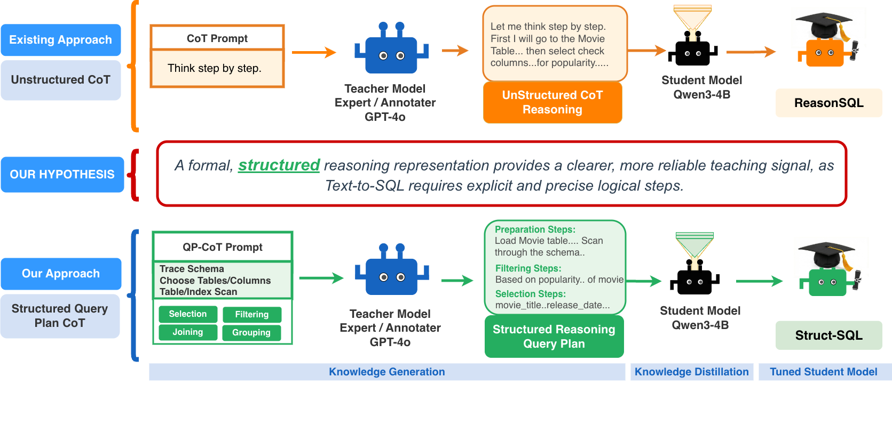

# Crater Labs Struct-SQL: Distilling Structured Reasoning for Small Text-to-SQL Models

[](https://arxiv.org/abs/2512.17053)
[](https://huggingface.co/craterlabs)
[](https://huggingface.co/datasets/craterlabs/struct-sql-data)
[-brightgreen)](https://bird-bench.github.io/)
[](LICENSE)

> **Dataset Available:** Our structured distillation dataset is publicly available on HuggingFace: [craterlabs/struct-sql-data](https://huggingface.co/datasets/craterlabs/struct-sql-data)

Struct-SQL addresses the enterprise **adoption trilemma** in Text-to-SQL systems: **cost**, **security**, and **performance**.

By distilling a **structured query-plan reasoning signal** from a large teacher model, Struct-SQL enables **SLMs** to approach the reasoning behavior of frontier LLMs while remaining suitable for private, low-latency deployment.

---

## Core Idea: Structured Reasoning as the Teaching Signal



**Key Takeaways:**

* **Structured Reasoning for Distillation:** Query execution plan instead of free-form Chain-of-Thought.
* **Fewer Syntax Errors:** Reduced schema hallucinations and clause issues.
* **Better SLMs:** **+8.1% EX** over unstructured distillation baselines.

---

## Proof of Performance

### #1 on BIRD among ≤4B models (as of Jan 30, 2026)

Struct-SQL achieves **60.42% execution accuracy** on the official BIRD test set using a single 4B-parameter model with greedy decoding and no self-consistency.

### Main Results (BIRD mini-dev)

All experiments use Qwen3-4B-Instruct-2507 as the base model.

| Model                          | Training Strategy         | EX (%) |
|--------------------------------|---------------------------|--------|
| Qwen3-4B-Instruct-2507 Base    | No Finetuning             | 17.0   |
| FN-Gold                        | Finetuning with Gold SQL  | 34.3   |
| ReasonSQL                      | Distillation with CoT        | 36.9   |
| **Struct-SQL**                 | **Distillation with QP-CoT** | **45.0** |

**+8.1% absolute improvement** over the ReasonSQL baseline.

---

## Training Efficiency

On a single **NVIDIA H200 GPU** with 1,000 distillation samples, Qwen3-4B-Instruct-2507 fine-tuned with Struct-SQL converged in **29.15 minutes** (2.24 epochs) using early stopping (patience=8, threshold=0.001).

| Method                       | Samples | Time       | Epochs |
|------------------------------|---------|------------|--------|
| FN-Gold                      | ~9,000+ | 110.57 min | 4.33   |
| ReasonSQL (Unstructured CoT) | 1,000   | 25.24 min  | 6.40   |
| **Struct-SQL (ours)**        | **1,000** | **29.15 min** | **2.24** |

Struct-SQL matches ReasonSQL's compute cost while delivering **+8.1% EX** — and trains **4× faster** than the full-dataset FN-Gold baseline. The 1,000-sample budget makes structured distillation practical in resource-constrained environments.

---

## Quick Start

### 1. Installation

```bash
git clone https://github.com/craterlabs/Struct-SQL-Distillation.git
cd Struct-SQL-Distillation
pip install -r requirements.txt
```

**Optional — FlashAttention-2** (recommended for faster training on Ampere+ GPUs):

```bash
pip install flash-attn --no-build-isolation
```

> FlashAttention must be installed *after* PyTorch. If unavailable, the model falls back to SDPA automatically.

### 2. Configuration

```bash
cp config.ini.example config.ini
# Edit config.ini and fill in your credentials and dataset paths
```

### 3. Generate Curated Datasets

Run the data generation script to classify SQL complexity and create stratified datasets for distillation.

```bash
python generate_data.py \
    --output_dir ./kd_data/ \
    --train_size 2000
```

> Generated datasets will be stored in `kd_data/`.

For more details, refer to [`DATA_GENERATION_GUIDE.txt`](guide/DATA_GENERATION_GUIDE.txt).

### 4. Run Distillation Training

Train directly from the HuggingFace dataset (recommended):

```bash
python run_kdistill.py \
    --config-file config.ini \
    --dataset craterlabs/struct-sql-data
```

Or from local JSON files produced by `generate_data.py`:

```bash
python run_kdistill.py \
    --config-file config.ini
```

Edit the `finetuning_experiment_configs` list near the top of `run_kdistill.py` to adjust LoRA rank, learning rate, batch size, epochs, and quantization. Set `"max_steps": 5` for a quick debug run.

For more details, refer to [`RUN_DISTILLATION_GUIDE.txt`](guide/RUN_DISTILLATION_GUIDE.txt).

### 5. Run Inference & Evaluation

```bash
python run_inference.py \
    --input_file ./data/BIRD/dev/dev.json \
    --db_path ./data/BIRD/dev/dev_databases/ \
    --tables_file ./data/BIRD/dev/dev_tables.json \
    --model_path craterlabs/Struct-SQL \
    --prompt_file ./prompts/structsql.txt \
    --output_file ./exp_results/predict_dev.json \
    --batch_size 2
```

> Prediction outputs will be stored in `exp_results/`.

Or use the provided script — make sure to update the paths:

```bash
bash run.sh
```

For more details, refer to [`RUN_INFERENCE_GUIDE.txt`](guide/RUN_INFERENCE_GUIDE.txt).

To evaluate predictions, we use the official [BIRD benchmark evaluation scripts](https://github.com/AlibabaResearch/DAMO-ConvAI/tree/main/bird). Follow the instructions in that repository to compute execution accuracy (EX) on the generated `predict_dev.json`.

---

## Model Availability

Our fine-tuned models are available on HuggingFace:

| Model | Base | Parameters | BIRD EX |
|-------|------|------------|---------|
| [craterlabs/Struct-SQL](https://huggingface.co/craterlabs/Struct-SQL) | Qwen3-4B-Instruct-2507 | 4B | 60.42% |

---

## Citation

If you use Struct-SQL in your work, please cite our publications:

```bibtex
@article{thaker2025knowledge,
  title   = {Knowledge Distillation with Structured Chain-of-Thought for Text-to-SQL},
  author  = {Thaker, Khushboo and Bresler, Yony},
  journal = {arXiv preprint arXiv:2512.17053},
  year    = {2025}
}

@inproceedings{thaker2026structsql,
  title     = {Struct-SQL: Distilling Structured Reasoning for Small Text-to-SQL Models},
  author    = {Thaker, Khushboo and Bresler, Yony},
  booktitle = {Proceedings of the 39th Canadian Conference on Artificial Intelligence},
  year      = {2026},
  note      = {Accepted}
}
```

---

## License

This project is licensed under Crater Labs (C). See [LICENSE](LICENSE) for details.

---

## Contact

For questions or collaboration inquiries, please open an issue or contact the authors.
